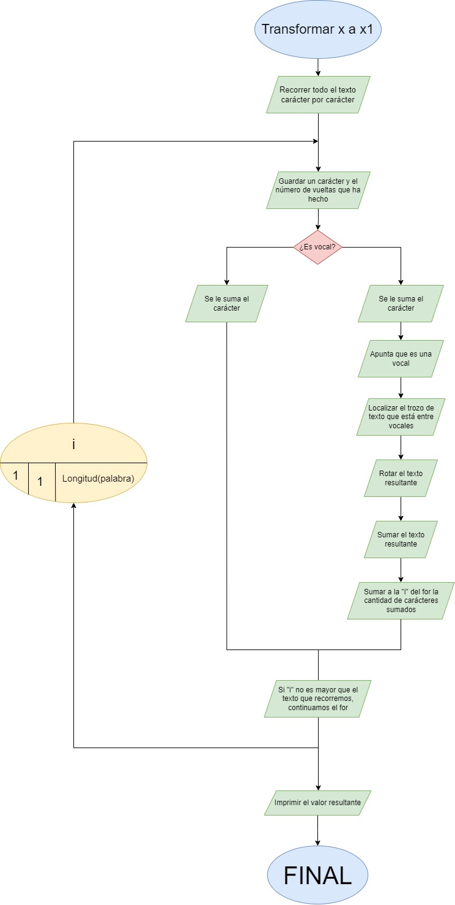
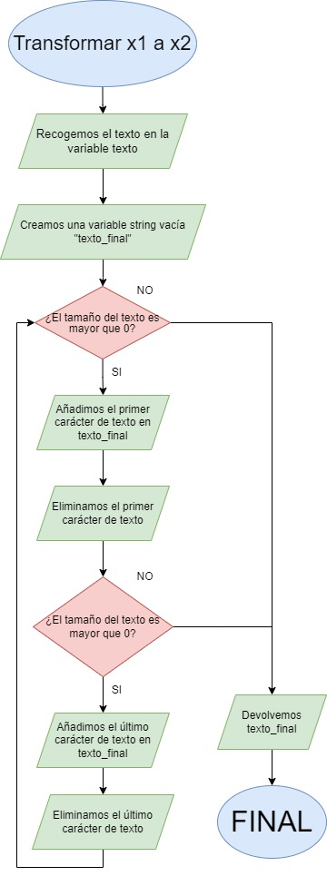
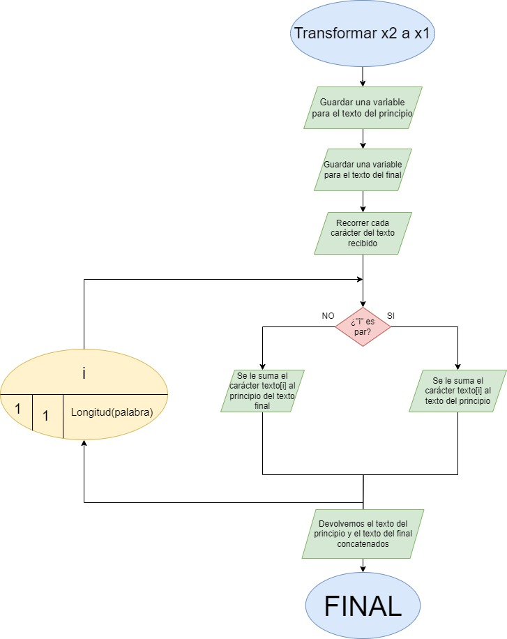

# Proyecto: Problema Número 197 - Mensaje Interceptado

Este proyecto ha sido desarrollado en la clase de **Desarrollo de Aplicaciones Web** en Jesuïtes Bellvitge. El objetivo principal es fortalecer la lógica de programación y dar los primeros pasos en el uso de **Git** y **GitHub**, utilizando GitHub Pages como parte del proceso. El trabajo se realiza en parejas, fomentando el trabajo colaborativo y la resolución de conflictos mediante la integración de código en un mismo repositorio.

## Objetivo
Desarrollar un algoritmo que descodifique un mensaje interceptado, utilizando como referencia la ficha "**Problema número 197 - Mensaje interceptado**". La solución debe incluir tanto el pseudocódigo o diagrama de flujo como la implementación en un lenguaje de programación. Cada miembro del equipo debe implementar una de las transformaciones:
- **Transformación X'' -> X'**
- **Transformación X' -> X**

## Estructura del Proyecto

### 1. Preparación del Repositorio
El proyecto se ha subido a GitHub en un repositorio llamado `problemanum197`. Se utiliza **Git** para controlar las versiones del código y gestionar los conflictos que puedan surgir al trabajar en equipo.

### 2. Análisis del Problema
El enunciado del problema nos plantea la interceptación de un mensaje encriptado en dos pasos:
1. Transformación de **X''** (el mensaje encriptado) a **X'** (una versión intermedia del mensaje).
2. Transformación de **X'** a **X** (el mensaje original).

Hemos decidido dividir el trabajo de la siguiente manera:
- **Mario**: Desarrolla la lógica para la transformación **X'' -> X'**.
- **Aina**: Desarrolla la lógica para la transformación **X' -> X**.

### 3. Diagrama de Flujo
Los siguientes diagramas de flujo muestran el proceso de encriptación y desencriptación de un mensaje.

Este algoritmo transforma de **x** a **x'**


Este algoritmo transforma de **x'** a **x''**



Este algoritmo transforma de **x''** a **x'**


### 4. Desarrollo del Algoritmo

#### 4.1. Transformación de X'' a X' (Mario)

La función `decryptXii` se encarga de la primera transformación. El texto se divide en dos partes:
- Los caracteres en posiciones pares se mantienen en su lugar.
- Los caracteres en posiciones impares se agregan al final, pero en orden inverso.

```javascript
function decryptXii(text) {
    let textPrincipio = '';
    let textFinal = '';
    for (let index = 0; index < text.length; index++) {
        if (index % 2 === 0) {
            textPrincipio += text[index];
        } else {
            textFinal = text[index] + textFinal;
        }
    }
    return textPrincipio + textFinal;
}
```

#### 4.2. Transformación de X' a X (Aina)

La segunda transformación se realiza mediante la función `deEncryptText`. Esta función identifica las vocales y rota los caracteres entre ellas, invirtiendo su orden.

```javascript
function deEncryptText(textX) {
    const vocales = ["a", "e", "i", "o", "u"];
    var resultText = "";
    for (let i = 0; i < textX.length; i++) {
        let actualChar = textX[i];
        resultText += actualChar;
        if (vocales.includes(actualChar.toLowerCase())) {
            i++;
            var temporalStrim = "";
            for (let j = i; j < textX.length; j++) {
                let temporalActualchar = textX[j];
                if (vocales.includes(temporalActualchar.toLowerCase())) {
                    break;
                }
                temporalStrim += temporalActualchar;
            }
            var finalStrim = "";
            for (let j = temporalStrim.length - 1; j >= 0; j--) {
                finalStrim += temporalStrim[j];
            }
            resultText += finalStrim;
            i += finalStrim.length - 1;
        }
    }
    return resultText;
}
```

### 5. Conflictos y Colaboración

Durante el desarrollo del proyecto, enfrentamos un desafío importante: la integración de JavaScript resultó complicada para Mario, ya que nunca había trabajado con este lenguaje. Por otro lado, Aina contaba con un amplio conocimiento gracias a la experiencia adquirida durante sus prácticas en la empresa. Sin embargo, se logró superar este obstáculo gracias al apoyo de Aina, quien explicó a Mario los conceptos necesarios y le brindó el soporte adecuado para que pudiera entender el funcionamiento del código y contribuir al proyecto de manera efectiva.

### 6. GitHub Pages

El proyecto ha sido desplegado utilizando **GitHub Pages**, lo que permite visualizar la aplicación web directamente desde el navegador. Utilizamos la rama `main` para el despliegue.

Para acceder al proyecto, visita el siguiente enlace:  
[Enlace al proyecto desplegado en GitHub Pages](https://tu-usuario.github.io/problemanum197/).

### 7. Conclusiones

Este proyecto ha sido una excelente oportunidad para aplicar conceptos de programación y trabajo colaborativo. Nos ha permitido:

- Mejorar nuestras habilidades en **JavaScript**, especialmente en manipulación de cadenas y control de flujo.
- Aprender a utilizar **Git** y **GitHub** de manera efectiva, gestionando un proyecto en equipo, resolviendo conflictos y desplegando la aplicación con **GitHub Pages**.
- Reforzar la importancia de la comunicación y organización en el trabajo colaborativo.

En conclusión, la actividad no solo nos ha ayudado a mejorar nuestras capacidades técnicas, sino que también ha fomentado la colaboración y la gestión eficiente de un proyecto de desarrollo.
